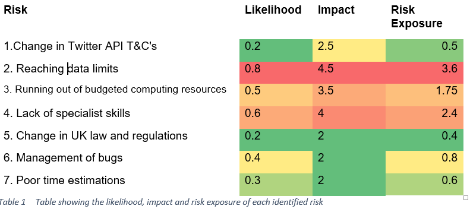

# Project Risks and Risk Management

A risk is categorised as an unknown that cannot be predated or prevented but whose likelihood may be estimated. This section identifies the potential risks that could have had an effect on either development or the final solution, and the plans that were taken to minimise their impact on the project. Identifying risks before development allowed for better control over the project hence made it easier to manage uncertain evets. 

The following is based on Boehm’s (1991) categorisation of software risks, and puts into practice some of the principles from the ISO 31000:2009. Boehm describes how important risk management is to avoid project disasters, rework and overkill.

### Risk Identification
The following risks were identified relating both specifically to this project and more broadly from Boehm’s top ten project risk factors.
	Change in Twitter API T&C's – The whole project was dependent on Twitter data. Twitter have very strict and comprehensive T&C’s which do change quite regularly in accordance with law.
	Reaching data limits (Google Places, Twitter, HP HavenOnDemand) – In order for the system to use live or real-time data, API’s will be required, and they all have data limits which cannot be exceeded without paying a fee.
	Running out of budgeted computing resources – cloud computing was used, for this there is a limited amount of computing resources that can be used to stay within budget.
	Lack of specialist skills – the project used a lot of brand-new and cutting edge technologies some of which have limited information available on the net which could have posed as a problem, while upskilling for development, and for future maintenance.
	Change in UK law and regulations relating to data privacy – a lot of user data from social media streams is being utilised in the system. This data being made public requires law not to change drastically over the time frame of the coming few years.
	Management of bugs and unexpected glitches – as with any project there are bound to be some unexpected bugs, which can take a variable amount of time to fix.
	Poor time estimations – the project schedule put forward in the proposal was ambitious, and there potentially could have be problems sticking to it in the face of unexpected events.

### Risk Assessment
Risks were calculated using Bernstein’s (2005) method. Risk exposure = likelihood * impact. Where the likelihood is between 0 and 1, and the impact between 1 and 5. Quantifying the risks allowed the project risks to be prioritised.
Risk	Likelihood	Impact	Risk Exposure

 

### Risk Severity Matrix

The risk severity matrix highlights which risks should be prioritised based on their likelihood to occur and the potential impact they could have had on development or the final project.

### Risk Response
The risk assessment highlighted three risks which attention should be paid to.
1.	Reaching data limits on the utilised API’s
2.	Running out of computing resources
3.	Lack of specialist skills

Reaching the data limits for Google places, Twitter and any other API’s utilised could have had a major impact on the final project. A risk reduction approach was taken, where possible data was cached to minimise requesting similar data. Data requests were only sent when necessary, and background tasks are stopped when the application is idle. In the future it may be necessary to limit the amount of requests from each user, to avoid a single user sending off 1000’s of requests to drain resources.

The risk for running out of computing resources can be transferred if necessary. A cloud computing server with much higher specs can be utilised, or a plan with unlimited bandwidth can be selected. At present that hasn’t been necessary, and nor will it be in the short-run.

The lack of specialist skills was a risk that just had to be accepted. I upskilled as much as possible and used available resources to gain the knowledge needed.

The majority of the other lower priority risks were reduced by allowing for contingency time. The amount of contingency allowed for each stage has been highlighted in the GANNT chart. Approximately 10% or one week extra for each separate phase of the project.
