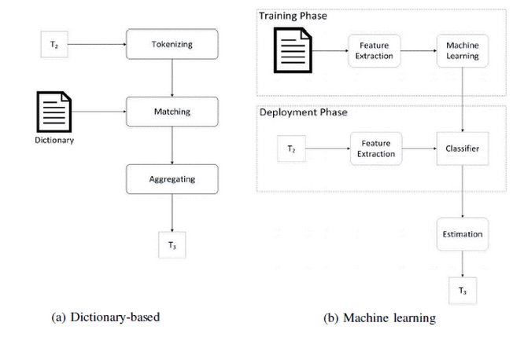

#	SENTIMENT ANALYSIS:
> AN EXECUTIVE ASSESSMENT OF REPRESENTING TRENDS IN OPINIONS EXPRESSED ON SOCIAL MEDIA

## Abstract
The purpose of this literature review is to explore how sentiment analysis can be used to visually represent people’s opinions, and more specifically how theses visual representations can illustrate trends of sentiment mapped against factors such as time, location or topic. It will also touch on the different methods of analysing sentiment as this dictates what type of trends can be mapped.

## Introduction
Despite the mass amounts of data uploaded every day to public social media networks (500 million Tweets per day), and the advances in sentiment analysis and natural language understanding. Research into applying sentiment analysis to social media data to find trends has been limited. The purpose of this review is to explore the potential of gaining an insight into an overall attitude towards specific topics from analysing social media channels, and how the trends from these attitudes can have practical applications.

## Related Work and Current Applications for Twitter Data
Twitter data can be used to show trends and then make predictions for the future based on historical events. Meesad (2014) outlines how trends from past events can be mapped to stock prices, and this, in turn, can be used to reasonably accurately predict future stock prices, aiding investors to make better trading decisions. 
The social Web is also being commercially exploited for purposes such as automatically extracting customer opinions about products or brands (Bansal et. Al 2004). This gleaning of Twitter data can then be used to gain a deeper understanding of people’s behaviour and actions (Wenbo Wang et. al 2012). One key use for this insight into people opinions would be to aid marketing campaigns, as companies will have a better understanding of what techniques were effective in successfully marketing a product or service.
Dr. Tariq Mahmood et. Al (2013) describes how in the 2013 Pakistani Elections, they were able to use a large set of Twitter data from Pakistan, to accurately predict the winners of the election. The algorithm worked by applying a series of predictive rules to the data and categorising Tweets based on which rules they followed. This again	provides a valuable insight into the country’s political future before any official results have been released, and information like this couldn’t possibly be collected on this scale with any conventional data collection method.

## Comparing the different methods of sentiment analysis 
There are several different ways of calculating the sentiment from a string of text, but two key underlying approaches. The first is a dictionary based method, this is where there is a database of words each with a score of how positive or negative the word is. An algorithm then calculates the overall aggregated score for a given string based on the database. The second method uses natural language understanding and machine language to return much more detailed and accurate results. However, this is not readily available without large amounts of computing power nor is it easily possible on large sets of data.
Within the machine language method, there are a number of different algorithms that can be used. Dr. Tariq Mahmood et. Al (2013) shows a good comparison between three of them on page 4 of his paper. The CHAID algorithm was slightly more accurate than the Naïve Bayes and Support Vector Machine but the results were close. These algorithms are used as the base for the data structure which in turn dictates what order it gets sorted, which will directly affect results as the system learns as it goes along. This works in a similar way to the semantic text plagiarism detection technique outlined by Osman (2013) which looks at semantic allocations of each sentence to gain an understanding of what the underlying message is.
Vu Dung Nguyen (2013) quantivley compares both the dictionary-based and the machine learning approach to sentiment analysis. In this paper, they were studying reactions to the Royal birth. 
A key difference between the efficiency of the two approaches is that the machine learning method requires each Tweet to be analysed individually and then the results are aggregated, however the dictionary-based approach can analyse all Tweets at once, as it is simply assigning a score by each word. The following diagram illustrates this concept.
 
 
 

When comparing the results of dictionary-based methods and machine language methods, there are some differences. The dictionary-based results seem to be consistently lower (more negative) than the natural language results, however, the overall sentiment trend that is plotted is very consistent between the two methods. This is the difference in sentiment value is likely to be caused by there being significantly more negative words in the English language than positive words.
