# Screen Shots

## The Search Page  
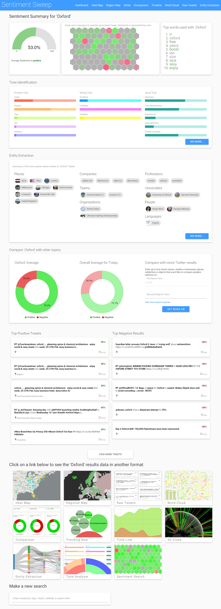

This is the second entry point after the homepage, it gives a summary or sentiment results to the user regarding a specific search term or topic, and provides links to view that topic in another form - such as on a geographical map, on a time line or a keyword diagram.

The majority of the search page is written in D3, and loaded with AJAX calls, as there is too much data to load before rendering the page. This page is not real-time, but does have links to real-time sentiment information about that topic.

The page is split into seven sections, the first of which gives an overall summary of sentiment illustrated with the red and green interactive hexagons (which can be hovered over to read each tweet), a guage showing percentage positive or negative and the keywords trending for that search term and weather each is positive or negative. 

The second section is a summary of what tones of speech are conveyed in tweets from that topic, this includes things like joy, sadness, anger... and there is a button allowing the user to see more information regarding writing tone from their topic.

The third section gives a quick overview of the entities extracted from the text, such as places, sports teams, people, languages... Each one is associated with a picture and more info which can be viewed by clicking.

The next section shows how this topic compares overall to the average on twitter, and it gives the user the opportunity to enter other search terms to compare against, e.g. a competitor brand.

A sample or raw tweets are also shown, both positive and negative. The user can click load more to view more.

Finally there are 10 links to view sentiment data from their topic or search term displayed in a different visual form, such as heat-map or timeline.

## The Start Screen
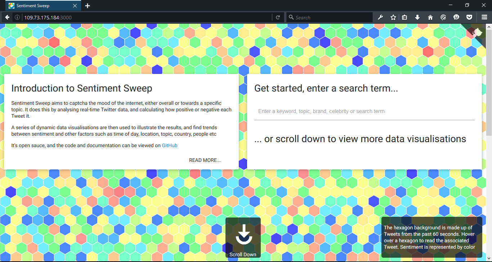

This is the default landing screen for the application. There are two main routes from here; make a search, or scroll/click down do view a list of links to all other sections of the site.

The background is made up of colourful hexagons, where each one represents a Tweet, and the color indicates the sentiment (blue to green = positive, yellow - red = negative, and the shades of colours inbetween show sentiments inbetween accordingly). When the user hovers over a hexagon they can see the associated Tweet and key information about it. All Tweets are real-time so the hexagons are constantly changing.

The aim of this visualisation is to provide a snapshot of what the overall sentiment on Twitter is at that particular moment, by the color of the shapes - and it makes for a more interesting background than a plain white one.

Like most the other data visualisations on this site, it is coded in D3.js combined with Socket.io for the real-time functionality.

## The Start Menu Screen
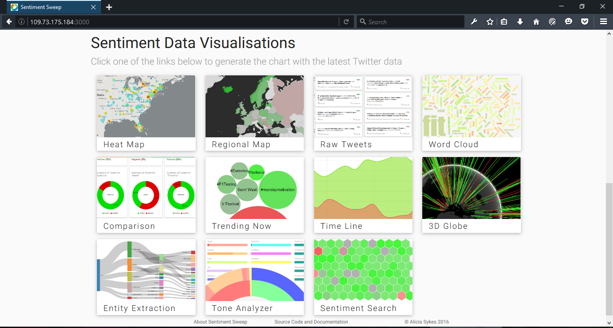

This is the second part of the homepage. It provides visual links to all the key data visualisations of the website.

## The Sentiment Heat Map
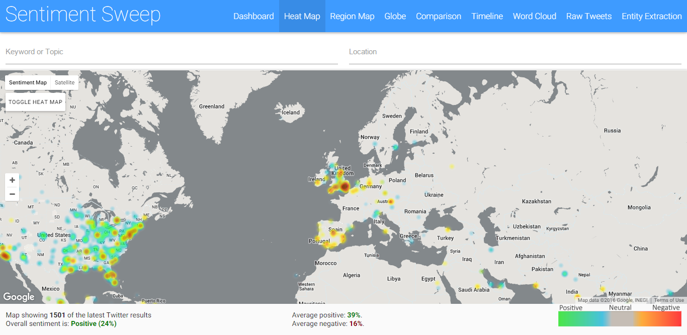

The sentiment heat map, is an interactive map, with a layer overlay that represents sentiment in that particular location by color. Red = negative, and green = positive, all colors inbetween indicate the sentiments inbetween, and grey is neutral.

The map is real-time, so as people Tweet the map develops. It is possible to click on a location and zoom to read particular Tweets. It is also possible to search for a specific topic, or location to show only results relating to that keyword. The aim of the map, is to show how sentiment varys with location, or more specifically how sentiment towards a particular topic can vary by location.

## Regional Sentiment Map
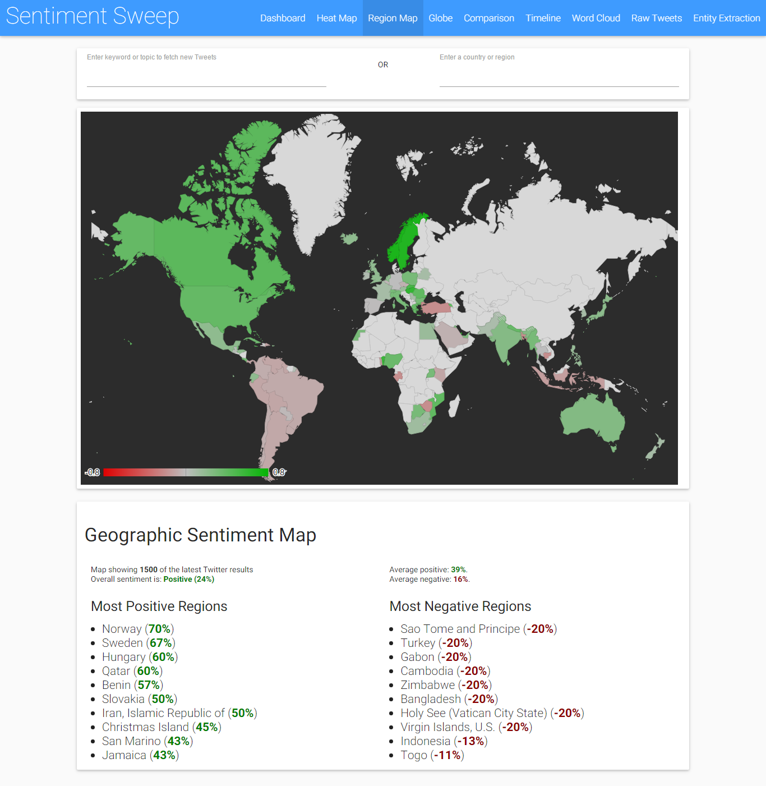

The heatmap is very useful for drilling down to view details about each Tweet in every location for a brand or topic, but often you just want to get a quick overview, such as which regions are most positive or negative towards a specific search term. That is what the regional map is for. 

The user can, again search either a keyword or location, and can then get an overview of how people talk about that topic illustrated geographically.

## Trending
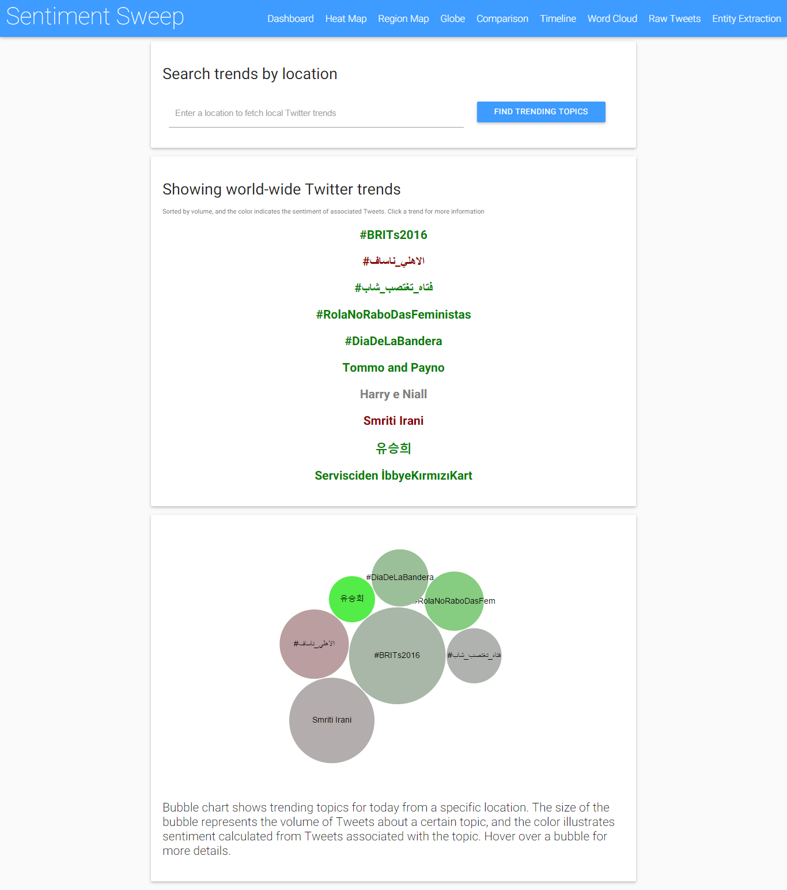

A popular feature of many social websites (Facebook, BBC, Twitter...) is what's currently trending - that is to say what others are currently talking about. This visualisation aims to show both, what is trending on social media, and how positive/ negative it is. Thousands of Tweets relating to each topic are analysed to build up a detailed picture of what people are saying.
Below the trends is a bubble chart developed in D3, which illustrates the trends, the size of the bubble indicates the volume of Tweets, and the color shows sentiment. Both the bubbles and the text above is clickable to view more information about a specific trend.

It is also possible to show just local trends, where the user can enter a location - any location, which is then looked up using Google Places API to find the latitude and longitude, and then trends and sentiment is calculated based on just that local area. This generally generates much more relavant and interesting results than world-wide trends.

## Text Tweets

This page simply displays Tweets in their text form, useful for reading exactly what people are saying, both positive and negative, about a specific topic. 

The Tweets are displayed in two columns, split by sentiment. The location (based on the users profile), and the time are also shown. Keywords are higlighted in bold, and are clickable. The sentiment value is given as a percentage in red or green. Tweets are real-time, so new Tweets will show up when they come in.

## Word Cloud
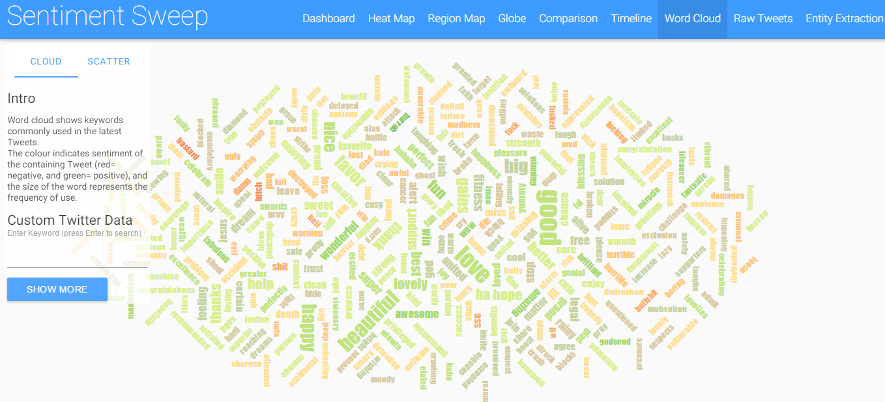

The word cloud shows keywords commonly used in either recent Tweets, or Tweets relating to a user-defined search term. The size of the word represents how often it is used, and the color is sentiment. The words are clickable for more details. The aim of this data visualisation is to give an overview of which positive and negative words are used to describe a product, service, brand, object or person.

## Word Scatter
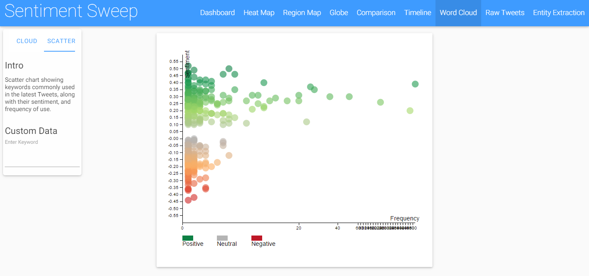

This is another data visualisations for showing words, but in a different form, and able to cope with much larger amounts of data, as well as real-time results. Each point represents a keyword, and the x-axis shows volume of use, and the y-axis show's sentiment. You can hover over a point to view the word, along with more information about it.

## 3D real-time sentiment globe
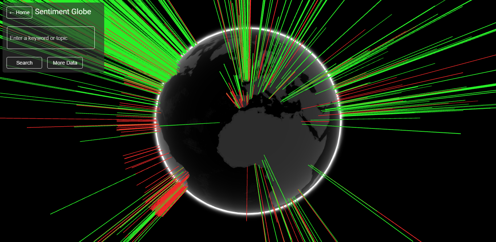

This data visualisation is a bit of fun, it shows sentiment geographically either for all Tweets over the past 60 minutes, or for a specific search term. Green bars = positive, and Red bars = negative, where the height of the bar represents the volume of Tweets from that area. The globe can be rotated wither with mouse or touch screen. If the user clicks "More data" they can see key stats about the info shown on the globe.

## Time Line

The timeline show's sentiment over time. The aim is to capture which time of day people Tweet the most positive or negative things, either overall or regarding s apcific topic or search-term.

It show's time on the x-axis, and sentiment on the y-axis. The green area represents the volume of positive tweets, whereas the red area represents the volume of negative tweets. Time is relative to the local timezone of the location each tweet is from.

## Topic Comparison
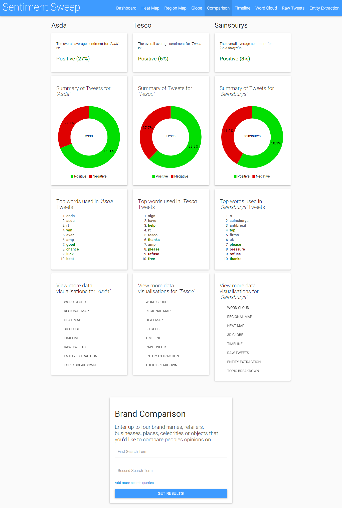

The purpose of this page is to allow the user to compare opinions towards multiple topics. It is mainly intended for comparing brands, but can have many more uses. The user enters up to 4 search terms, and tweets relating to each are fetched, analysed and then visually displayed in the form of a donut chart. The key words and trends from each topic are also displayed below, as this is often very useful for getting a snapshot of why a brand or topic is currently so positive or negative. There are also links to view each of the topics in the other forms listed above, such as timeline, word cloud, geographical map or raw tweets.

## Tone Identification
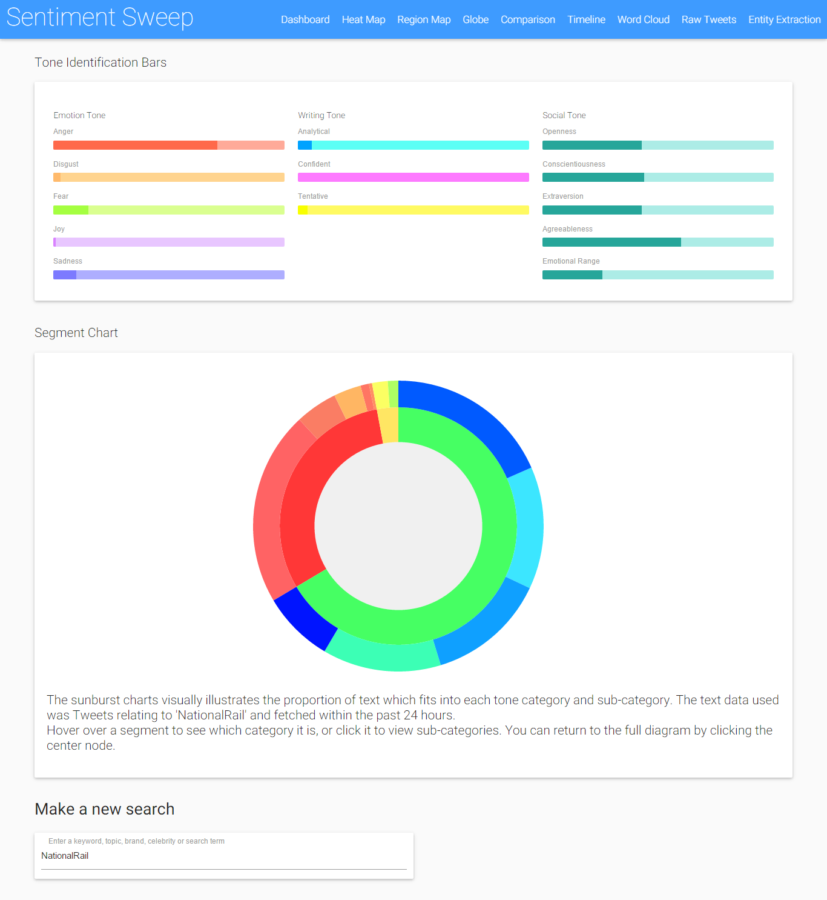

A combination of IBM Watson and the custom sentiment analysis algorithm written for this project has been used to draw out the key tones conveyed by Tweets from a particular topic. These include emotional tone(such as anger, fear, joy or sandness), writing tone (such as analytical, confident or tentative) and social tone (such as openeess, extraverson, agreeablness...)

This can sometimes be much more useful than displaying the positive: negative ratio for a topic. Results are displayed with CSS data bars, and with a zoomable segment chart developed in D3.

## Entity Extraction
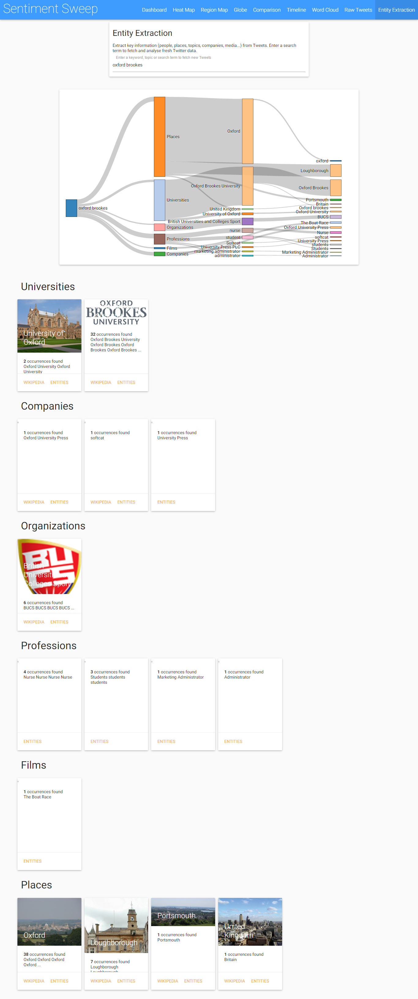

Entity extraction involves determining the key topics, places, people, objects.... that are spoken about in a set of tweets, and then categorising each of them, and calculating the sentiment accordingly. For this part, the sentiment analysis module was used in conjunction with HP's artifical inteligence API - Haven OnDemand.

A sankey chart is generated using D3 to show the results from the users search term. There are also boxes below to give more details on each, and pictures/ wikipedia links/ sentiment info...

## Topic Identification
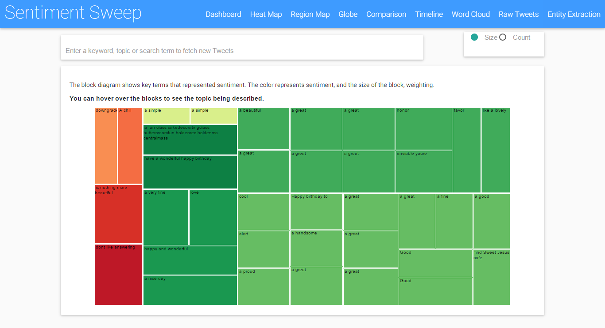

This extracts phrases which illustrate sentiment, and show's the topic they relate to when the user hovers over it. For example "nothing more beutiful" expressis a sentiment, and the topic is "sunset". The color show's sentiment, and the size of the block show's weighting.

## Hexagons
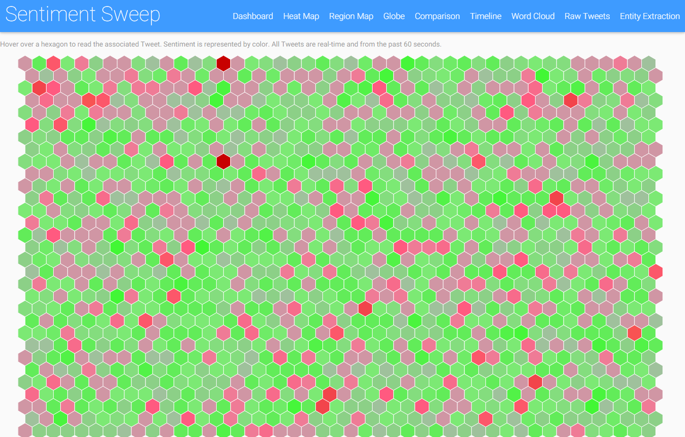

Just because hexagons are cool, and the homepage didn't quite have enough! This data visualisation was developed in D3.js along with Hexabin, it show's real-time tweets and the shade of red or green illustrates how positive or negative each tweet is. The user can hover over a hexagon to see the associated tweet and sentiment score, and they can also search for a custom data set.

