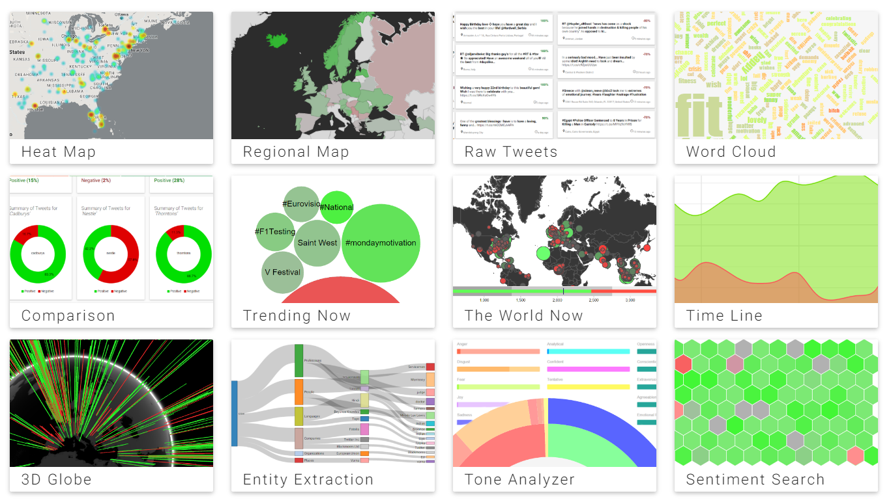

# Twitter Sentiment Visualisations

> A web app that uses data from Twitter combined with sentiment analysis and
> emotion detection to create a series of data visualisations to illustrate
> the happy and less happy locations, topics and times.

## Introduction
This project aims to make Twitter data more understandable. It streams real-time
tweets, or can fetch tweets about a specific topic or keyword - it then analyses this data
using a custom-written sentiment analysis algorithm, and finally displays the results with
a series of dynamic D3.js data visualisations.

The aim of the app is to allow trends to be found between sentiment and other
factors such as geographical location, time of day, other topics...

It has a wide range of uses, from analysing the effectiveness of a marketing campaign,
to comparing two competing topics.

Read more about the application [here](docs/project-introduction.md).

The application is fully documented, which can be viewed [here](docs/readme.md)

## Live Application
A live demo of the application has been deployed to: [http://sentiment-sweep.com](http://sentiment-sweep.com)

## Screen Shots
As part of the documentation there is one shot of each screen in it's current state. [View screen shots here](docs/screenshots/readme.md)

Below is a sample of the 12 key screens.

## Modules
Several open source node modules have been developed and published on npm as part of this project
- [sentiment-analysis] - useses the AFINN-111 word list to calculate overall sentiment of a sentence
- [fetch-tweets] - fetches tweets from Twitter based on topic, location, timeframe or combination
- [stream-tweets] - streams live Tweets in real-time
- [remove-words] - removes all non-key words from a string sentence
- [place-lookup] - finds the latitude and longitude for any fuzzy place name using the Google Places API
- [hp-haven-sentiment-analysis] - A Node.js client library for HP Haven OnDemand Sentiment Analysis module
- [haven-entity-extraction] - Node.js client for HP Haven OnDemand Entity Extraction
- [tweet-location] - calculates the location from geo-tagged Tweets using the Twitter Geo API
- [find-region-from-location] - given a latitude and longitude calculates which region that point belongs in

## Project Planning
- A set of [user stories with acceptance criteria] and [complexity estimates](docs/story-points.md) have been drawn up outlining what features the finished solution should have. They are also managed on the [Trello Board].

## Running Locally

1. **Prerequisites** - You will need [Node.js], [MongoDB] and [git]  installed on
your system. You will also need Gulp and Bower, which (once node is installed)
you can install by running `npm install gulp bower -g`. Also [Yarn] is recommended.

2. **Get the files** - `git clone https://github.com/Lissy93/twitter-
sentiment-visualisation.git` then navigate into it with `cd twitter-sentiment-visualisation`

3. **Install dependencies** -  `yarn` will install the npm node_modules,
then should automatically kick off a `bower install` (if not, then just run it manually).
If you are developing, you will need to use `npm install` in order to get the devDependencies too.

4. **Set Config** `yarn run config`  will generate the `config\src\keys.coffee`
file, which you will then need to populate with your API keys and save.
Also check that your happy with the general app config in `config/src/app-config.coffee`.

5. **Build Project** - `yarn run build` will compile the project, from the source.

6. **Start MongoDB** - `mongod` will start a [MongoDB] instance (run in separate terminal instance).
 See instructions: [Starting a MongoDB instance].

7. **Run the project** - Run `yarn start` then open your browser and navigate
to [http://localhost:8080]

View [detailed installation instructions]

To run the tests: `npm test` or see the more [test strategy]

To run in development mode, use `yarn run dev`. This will use dev environmental variables,
and also will watch for changes, lint, compile and refresh automatically.

## Automated Development Workflow
> TSV uses the Gulp streaming build tool to automate the development workflow.

The key tasks you need to run are:
- `gulp generate-config` - before first-time running of the project, run this command to generate configuration files for your API keys
- `gulp build` - This will build the project fully, this includes cleaning the working directory and then all tasks that must happen for CoffeeScript, JavaScript, CSS, images, HTML and Browserify tasks.
- `gulp nodemon` - Runs the application on the default port (probably 8080)
- `gulp test` - This will run all unit and coverage tests, printing a summary of the results to the console and generating more detailed reports into the reports directory.
- `gulp` - this is the default task, it will check the project is configured correctly, build ALL the files, run the server, watch for changes, recompile relevant files and reload browsers on change, and keep all browsers in sync, when a test condition changes it will also re-run tests - a lot going on!

To read more about the project setup and gulp process, see [build environment] in the docs

## Test Strategy
> Twitter Sentiment Visualisation follows the TDD approach and is structured around it's unit tests.

To run tests: `npm test`

**Testing Tools**
- Framework - [Mocha](https://github.com/mochajs/mocha)
- Assertion Library - [Chai](https://github.com/chaijs/chai)
- Coverage Testing - [Istanbul](https://github.com/gotwarlost/istanbul)
- Stubs, Spies and Mocking - [Sinon.js](https://github.com/sinonjs/sinon)
- Continuous Integration Testing - [Travis CI](https://github.com/travis-ci/travis-ci)
- Dependency Checking - [David](https://github.com/alanshaw/david)
- Automated Code Review's - [Code Climate](https://github.com/codeclimate/codeclimate)
- Headless Browser Testing � [PhantomJS](https://github.com/ariya/phantomjs)
- Testing HTTP services - [SuperTest](https://github.com/visionmedia/supertest)

More details on each of the tools and how they will be implemented along
with the pass and fail criteria can be found on the [test strategy] page
of the documentation.

## The Stack
This project wouldn't have been possible at all without making use of many many
open source packages, libraries, frameworks etc..

I would like to personally thank the hundreds of developers who have worked on open source packages like these.

There is an extensive stack of technologies that were used to develop the final application.
The following list is a summary of the key utilities:

## Documentation

### Project Information

[Project Introduction](docs/project-introduction.md)

[Addressing Potential Risks](docs/project-risks.md)

[System Development Life Cycle](docs/sdlc.md)

[Licence](docs/LICENSE.md)

---

### Project Planning
[User Stories](docs/user-stories.md)

[Complexity Estimates](docs/story-points.md)

[High Level UML](docs/high-level-data-flow.png)

[Methodology - frontend](docs/methodology-frontend.md)

[Test Strategy](docs/test-strategy.md)

----

### Development Documentation

[Installation Instructions](docs/installation-instructions.md)

[Build Environment](docs/build-environment.md)

[Testing](docs/test-strategy.md)

---

### Research

[The current sentiment analysis scene](docs/research-1-sa-current-uses.md)

[Comparison of various sentiment analysis algorithm approaches](docs/research-2-sa-comparison.md)

[References](docs/references.md)

   [Trello Board]: <https://trello.com/b/jWBg1vd1/twitter-sentiment-visualisation>
   [Node.js]: <https://nodejs.org/en/>
   [MongoDB]: <https://www.mongodb.org/>
   [Yarn]: <https://yarnpkg.com>
   [git]: <https://git-scm.com/>
   [Starting a MongoDB instance]: <http://docs.mongodb.org/master/tutorial/getting-started-with-the-mongo-shell/>
   [http://localhost:8080]: <http://localhost:8080>
   [detailed installation instructions]: <docs/installation-instructions.md>
   [test strategy]: <docs/test-strategy.md>
   [build environment]: <docs/build-environment.md>
   [user stories with acceptance criteria]: <docs/user-stories.md>

   [fetch-tweets]: <https://www.npmjs.com/package/fetch-tweets>
   [stream-tweets]: <https://www.npmjs.com/package/stream-tweets>
   [place-lookup]: <https://github.com/Lissy93/place-lookup>
   [tweet-location]: <https://www.npmjs.com/package/tweet-location>
   [remove-words]: <https://www.npmjs.com/package/remove-words>
   [sentiment-analysis]: <https://www.npmjs.com/package/sentiment-analysis>
   [hp-haven-sentiment-analysis]: <https://github.com/Lissy93/haven-sentiment-analysis>
   [haven-entity-extraction]: <https://github.com/Lissy93/haven-entity-extraction>
   [find-region-from-location]: <https://github.com/Lissy93/find-region-from-location>
